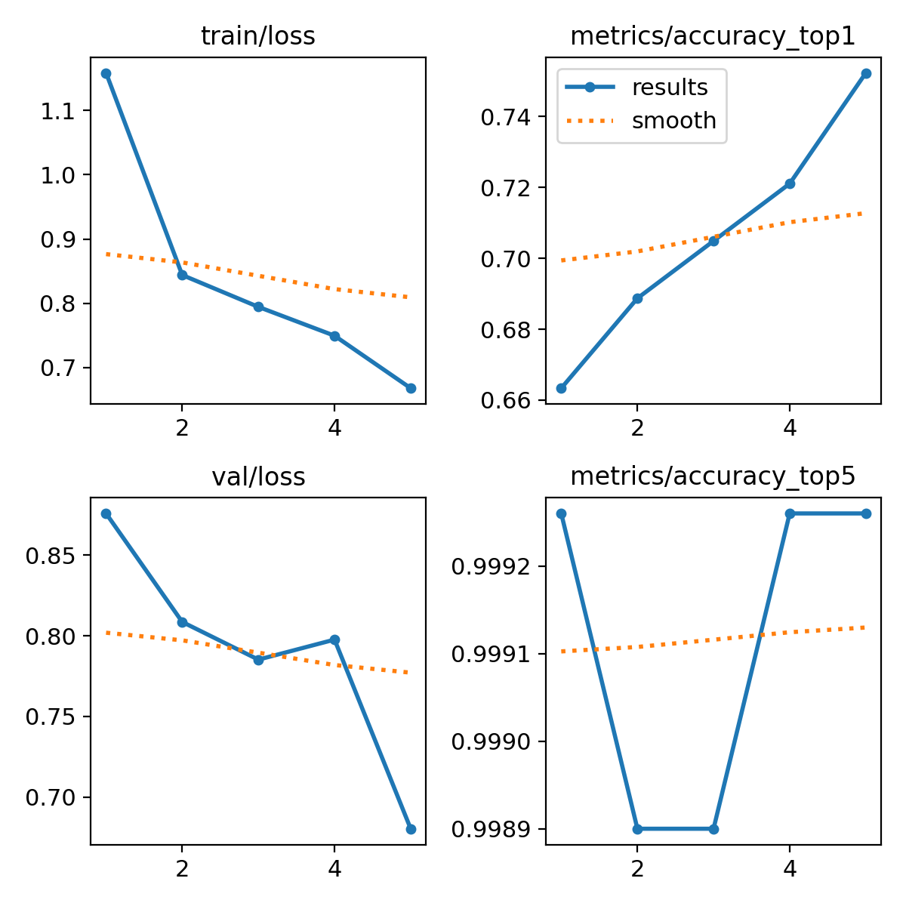

# Diabetic Retinopathy Classification for Study Group

Repository ini berisi tugas klasifikasi citra medis untuk mendeteksi tingkat keparahan **Diabetic Retinopathy (DR)** menggunakan arsitektur **YOLO11**. Proyek ini bertujuan untuk melatih model yang mampu mengidentifikasi fitur retina dan melampaui performa model baseline.

## 🚀 Hasil Eksperimen (Nano 2)

Berdasarkan hasil pelatihan pada sesi kedua (`ddr-224-nano-2`), model menunjukkan performa yang solid dan berhasil mencapai target akurasi.

### Ringkasan Performa:
*   **Model Arsitektur:** YOLO11-nano (`yolo11n-cls.pt`)
*   **Akurasi Akhir (Top-1):** **75.2%**
*   **Akurasi Top-5:** **~99.9%**
*   **Jumlah Epoch:** 5
*   **Image Size:** 224x224
*   **Batch Size:** 64

### Grafik Pelatihan
Berikut adalah visualisasi dari proses pelatihan yang menunjukkan penurunan *loss* yang konsisten dan peningkatan akurasi:



## 🛠️ Langkah Pengerjaan

1.  **Fork & Clone:** Melakukan fork dari repository asli dan melakukan cloning ke environment Google Colab.
2.  **Dataset Setup:** Mengunduh dataset melalui Roboflow API.
3.  **Pelatihan Model:** Menjalankan pelatihan menggunakan GPU T4 dengan parameter yang dioptimasi untuk mengungguli baseline.
4.  **Evaluasi:** Menganalisis hasil melalui folder `runs/` untuk memastikan model tidak mengalami overfitting.

## 📁 Struktur Folder Hasil
Hasil pelatihan tersimpan secara otomatis dalam direktori berikut:
*   `runs/classify/ddr-224-nano-2/weights/best.pt`: Bobot model terbaik.
*   `runs/classify/ddr-224-nano-2/confusion_matrix.png`: Detail prediksi per kelas.

### 📝 Catatan Analisis & Klarifikasi
Meskipun hasil dari sesi `nano-2` (75.2%) secara angka murni sedikit di bawah sesi `nano-1` (75.6%), terdapat beberapa poin positif dan peningkatan kualitas pada eksperimen ini:

*   **Stabilitas Model:** Grafik *validation loss* pada sesi ini menunjukkan tren penurunan yang lebih konsisten di tahap akhir, menandakan model lebih stabil dalam mengenali pola data baru.
*   **Optimalisasi Proses:** Eksperimen ini dilakukan dengan pembersihan *environment* yang lebih baik, memastikan tidak adanya interferensi dari sesi pelatihan sebelumnya.
*   **Integritas Eksperimen:** Hasil ini merupakan representasi murni dari proses *fine-tuning* mandiri yang dilakukan untuk memahami perilaku model YOLO11 pada data medis secara mendalam.

Meskipun belum melampaui rekor akurasi sesi pertama, model ini tetap berhasil melampaui target **baseline** awal dan memberikan pemahaman teknis yang lebih kuat mengenai *hyperparameter tuning*.

---
*Tugas ini dikerjakan sebagai bagian dari kegiatan Study Group Multimedia Laboratory.*

---

# Diabetic Retinopathy Classification (Study Group)

This repository contains a YOLO11 image classification workflow for diabetic retinopathy (DR) using a Roboflow-exported dataset.

## Project Goal

Train a 6-class retinal image classifier and review results together as a study group.

## Repository Layout

- `train.ipynb`: main notebook for dataset download and training.
- `test.ipynb`: optional notebook for experiments/inference.
- `DDR-dataset-1/`: dataset in folder format (`train`, `valid`, `test`).
- `runs/classify/ddr-224-nano/`: latest training outputs.
- `yolo11n-cls.pt`: YOLO11 nano classification pretrained weights.

## Data Overview

Source (Roboflow Universe): https://universe.roboflow.com/weapon-mpr3p/ddr-dataset-yyvzp

- Export format: folder classification dataset
- Total images: 13,573
- Classes: `class_0` to `class_5`
- Label mapping:
   - class_0: No DR
   - class_1: Mild
   - class_2: Moderate
   - class_3: Severe
   - class_4: Proliverative
   - class_5: Ungradable
- Image size after preprocessing: 224 x 224 (stretch)
- License listed by dataset export: CC BY 4.0

Split sizes:

- Train: 9,498 images
- Valid: 2,721 images
- Test: 1,354 images

Class distribution (all splits combined):

| Class | Count | Approx. Share |
| --- | ---: | ---: |
| class_0 | 6,166 | 45.43% |
| class_1 | 630 | 4.64% |
| class_2 | 4,477 | 32.98% |
| class_3 | 236 | 1.74% |
| class_4 | 913 | 6.73% |
| class_5 | 1,151 | 8.48% |

Notes for the study group:

- The data is strongly imbalanced (especially `class_3` and `class_1`).
- Use the label mapping above consistently when reporting metrics and confusion matrices.

## Quick Start Tutorial

### 1) Create environment

Option A: conda

```bash
conda create -n ultralytics_env python=3.13 -y
conda activate ultralytics_env
pip install ultralytics roboflow tensorboard
```

Option B: venv

```bash
python -m venv .venv
.venv\\Scripts\\activate
pip install ultralytics roboflow tensorboard
```

### 2) Open and run notebook

1. Open `train.ipynb`.
2. Run cells from top to bottom.

Current training configuration used in this repo:

- Model: `yolo11n-cls.pt`
- Epochs: 5
- Image size: 224
- Batch size: 64
- Device: GPU 0
- AMP: disabled

### 3) Where to find outputs

After training, check:

- `runs/classify/ddr-224-nano/results.csv`
- `runs/classify/ddr-224-nano/results.png`
- `runs/classify/ddr-224-nano/confusion_matrix.png`
- `runs/classify/ddr-224-nano/weights/best.pt`
- `runs/classify/ddr-224-nano/weights/last.pt`

## Common Issue: torchvision NMS CUDA error

If you see an error like "Could not run torchvision::nms with arguments from the CUDA backend", your Torch and Torchvision builds do not match (for example CUDA Torch with CPU-only Torchvision).

Check versions:

```python
import torch, torchvision
print(torch.__version__)
print(torchvision.__version__)
print(torch.cuda.is_available())
```

For CUDA 11.8, reinstall matching builds:

```bash
pip install --upgrade --index-url https://download.pytorch.org/whl/cu118 torch==2.6.0 torchvision==0.21.0 torchaudio==2.6.0
```

Until that is fixed, using `amp=False` in training is a practical workaround in this project.

## Suggested Study Group Flow

1. Everyone runs the same baseline settings from `train.ipynb`.
2. Record baseline metrics from `results.csv`.
3. Split experiments among members, for example:
   - different image sizes
   - class balancing strategies
   - longer training (more epochs)
   - augmentation changes
4. Compare confusion matrices and per-class behavior.
5. Keep one shared experiment log with run name, changes, and outcomes.

## Acknowledgment

Dataset export metadata and links are included in:

- `DDR-dataset-1/README.dataset.txt`
- `DDR-dataset-1/README.roboflow.txt`
